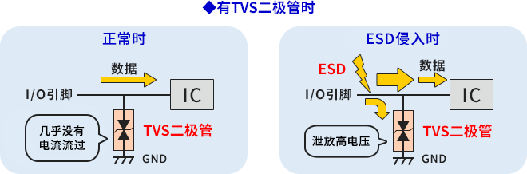
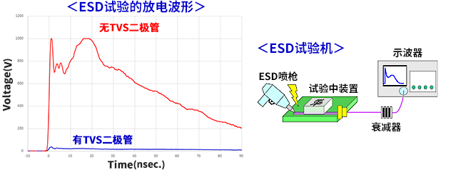
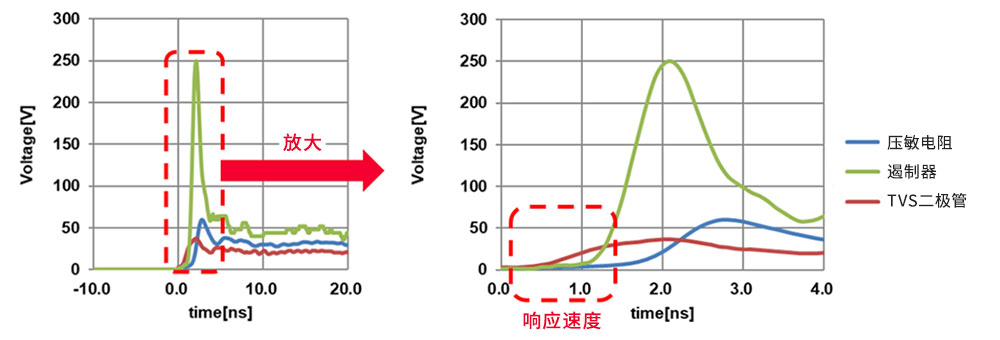
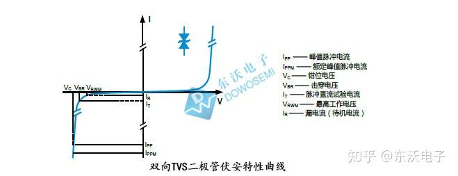

**ESD（Electro-Static discharge）**即**静电释放**，是EMC抗扰度（电磁兼容性）要求的一部分。它是设备为在电磁环境中正常运行而对可能造成物理损坏的电磁能量接收进行限制的能力。ESD可能以**瞬态电压**的形式出现，但其快速上升时间也可以导致辐射：强大的谐波与其他信号耦合将使应用呈现不稳定的行为。必须保护印刷电路板不受ESD的影响。

**TVS（TRANSIENT VOLTAGE SUPPRESSOR）**或称**瞬变电压抑制二极管**，是在稳压管（齐纳管）工艺基础上发展起来的一种新产品，其电路符号和普通稳压二极管相同，外形也与普通二极管无异。

当瞬态电压发生时，只要系统电压在规定的工作范围内，TVS二极管保持不活动状态。一旦瞬态电压超过二极管的击穿电压（V_BR），器件能以ps量级速度进入雪崩导通状态，将其两极间的高阻抗变为低阻抗。

- **击穿阶段：** 在该模式下，二极管会导通大电流，并将电压固定在安全水平（即最大钳位电压 V_C）。

- **能量释放：** 过量的瞬态能量会被导向地线，从而保护下游器件免受潜在损害。随后，TVS二极管会在瞬态结束时迅速返回到非活动状态。     

有无TVS二极管时IC侧电压的差异如下表所示。在此使用内置电容器（超级电容）和内部阻抗的ESD释放枪，施加8kV的ESD，通过示波器测量设备通过后的电压值。从图表的波形来看，因为具有TVS二极管，施加到IC侧的电压被大幅抑制。

TVS二极管在ESD侵入时响应速度很快，只要皮秒级即可激活，这是其与压敏电阻和遏制器相比的主要区别和优势。尽管TVS二极管比压敏电阻和遏制器的成本更高，但在配备了高性能、高成本IC的电子设备等当中，它仍被用于来自进行高速传输的数据线等的ESD保护。    

## 1. 关键参数

1. 最高工作电压 Vrwm：TVS的截止电压，可连续施加而不会引起TVS管劣化或损坏的最大的直流电压或交流峰值电压；
2. 漏电流 Ir：待机电流，在规定温度和最高工作压条件下，流过TVS管的最大电流；
3. 峰值脉冲电流 Ipp：在10/1000μs电流波形的峰值，是**二极管能承受住的最大电流**；
4. 钳位电压 Vc：施加规定波形的峰值脉冲电流IPP时，TVS管两端测得的峰值电压，**瞬态事件期间的峰值电压**；
5. 击穿电压 Vbr：在规定的脉冲直流电流IT或接近发生雪崩的电流条件下测得TVS管两端的电压，也是导致器件击穿的最小电压；
6. **结电容 CI：在高速数据接口或通信线路中的防护，要重点关注TVS管的结电容值；**
7. 响应时间：通常在ps级，确保对高频瞬态有效抑制。

**单向TVS二极管：** 适用于直流电路，针对单一电压极性提供保护。**双向TVS**二极管：适用于交流电路和数据线，可在正极和负极瞬态电压下提供保护。

## 2. 选型

1.  TVS**额定反向关断电压/最高工作电压** Vrwm应大于或等于被保护电路的最大工作电压。
2. TVS的**最大箝位电压VC**要小于后级被保护电路中最大可承受的瞬态安全电压；
3. 选择TVS管额定瞬态功率：要大于电路中可能出现的最大瞬态浪涌功率，具体估算等式：Pppm=Vc＊Ipp；（在规定的脉冲持续时间内，TVS的最大峰值脉冲功耗PM必须大于被保护电路内可能出现的峰值脉冲功率。在确定了最大箝位电压后，其峰值脉冲电流应大于瞬态浪涌电流。）
4. 评估漏电流和结电容的影响：在高速IO端口防护、模拟信号采样、数据接口、通信线路防护、低功耗设备场合，需要考虑漏电和结电容的影响；
5. 选择TVS管封装形式：封装体积大小决定TVS的功率大小，新老电子工程师可根据电路设计及测试要求来选择合适封装的TVS管；
6. 最小击穿电压VBR=VWM/KBR （其中，KBR=0.8～0.9）。

（未完）

## 参考

> https://www.rohm.com.cn/electronics-basics/diodes/di_what8
>
> https://zhuanlan.zhihu.com/p/393890631

