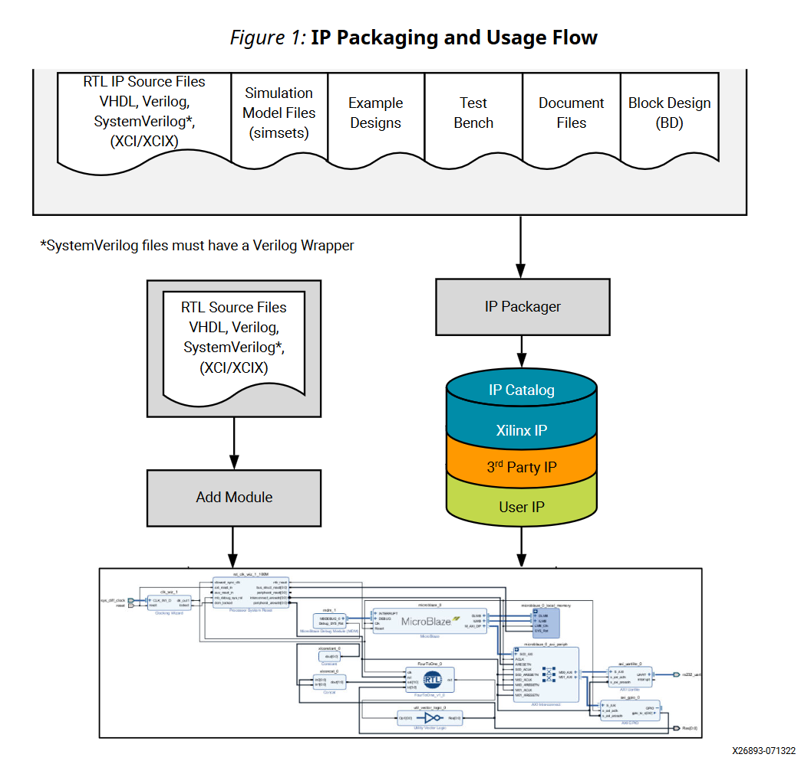
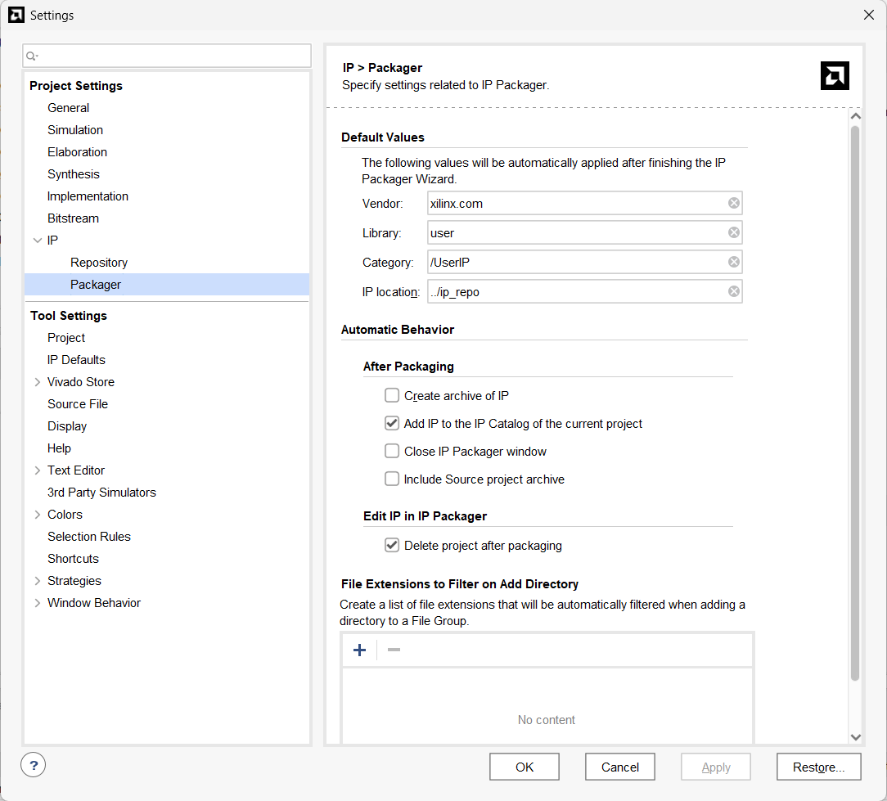

如何在Vivado中创建并封装自定义IP？阅读**UG1118(V2026.1)**

注意：如果你把普通、未加密的 RTL 打包成自定义 IP，并将完整 IP 包交给最终用户，包中的 `.v`、`.sv`、`.vhd` 文件仍是明文；用户可以找到并阅读它们。Vivado 打包器会把这些文件列入综合等文件组，**“打包成 IP”**本身不提供源码保密。

如果希望用户**能综合使用、但不能直接阅读 RTL**，可先按 UG1118 的 IEEE 1735 流程加密 RTL，再打包加密后的文件；这仍属于 RTL 交付，不会变成硬 IP。

# 1. 创建并封装IP

图示是一个IP如何被封装和使用。基于Vivado IP Packager，IP开发者可以：

1. 将RTL源码文件和相关数据打包至IP-XACT标准格式；
2. 在Vivado IP catalog中添加IP；
3. 将封装好的IP交付给最终用户，形式可以是存储库目录或归档文件（.zip）;

交付后，用户可以在其设计中使用该IP的customization版本（比如自定义IP参数）。在封装前，需要对源设计进行必要的仿真、综合、实现。

## Vivado IP Packager支持以下文件输入

HDL综合、HDL仿真、文档、HDL测试基准、示例设计、实现文件（包含约束和结构级网表文件）、驱动、自定义GUI（参数配置界面）、BlockDesign文件。**注意**：对于必须放置在特定目录中的文件，必须首先在 IP 目录下创建相应的文件夹结构。例如，可以将驱动程序文件放置在 data 目录下。另外，还可以将源文件或源文件中定义的模块和架构**加密**（encrypt），以保护IP。

IP Packager可以根据 IP 的具体情况，指定任意数量的文件组。系统并未强制要求必须包含特定数量的文件组；不过，基于已打包的项目源文件，“IP 文件组”（IP File Groups）页面会提供一组典型的文件组供参考。如果其中任何文件组为空，最终的“检查与打包”（Review and Package）页面将会针对缺失文件发出警告。

## Vivado IP Packager的输出

- 基于IP-XCAT 标准component.xml的**XML文件**。component.xml位于IP根目录，用于描述和标识该 IP 的定义信息。自定义 IP 所关联的其他文件，其路径均以该 IP-XACT XML 文件为相对路径基准。
- 一个 **XGUI 定制 Tcl 文件**。该文件位于 `<IP根目录>/xgui` 目录下，用于定义该自定义IP 在 IP Catalog 中显示的参数配置图形界面（GUI）。
- 根据用途分类存放在不同目录中的文件，例如：`/src`、`/sim`、`/doc` 等。
- 你创建的、用于存放已封装 IP 的任意 IP Catalog 目录。

## IP Packager的默认设置

Tools → Settings → Project Settings, select IP → Packager.

在一个project中，可以对IP Packager进行一些默认设置：如厂商名称Verdor、库名称Library（厂商名和库名、IP名构成IP的唯一标识符）、Category（指定IP放在IP catalog中哪个类别中）以及IP Location（封装IP的存放位置）。这些设置也可以在打包过程中修改。

还可以设置打包完成后的自动行为：（1）Create archive of IP，将IP打包成ZIP；（2）将打包后IP添加到当前工程的IP catalog中。值得注意的是最下面的File Extensions to Filter on Add Directory（**添加目录时需要排除的文件扩展名列表**），这里可以添加文件扩展名，这样在打包时系统会自动从文件组目录中**忽略掉**相应扩展名文件（类似于git中的.gitignore）。其他设置不赘述。

# 2. IP Packaging 基础

IP Packager向导有三种选项：

## 打包当前工程

IP Packager通过分析当前 Vivado 项目中的文件结构，自动推断打包该 IP 所需的文件类型（例如综合和仿真文件）。

在打包包含块设计（BD）的项目时，**可能会丢失 BD 的边界属性或元数据**（例如 FREQ_HZ、X_INTERFACE_* 属性）。为了保留这些信息，必须手动添加这些属性，或者将其从 BD 封装文件（例如 design_1.v）复制到项目的顶层源文件中。

**不允许打包含有DCP源文件的工程**。

## 打包当前工程中的block design√

如果用户的意图仅是将 BD 及其顶层 HDL 封装器（HDL wrapper）进行封装，那么这是首选方案。**该选项还能保留块设计（Block Design）中的所有寻址信息。**使用此选项，您可以正确地封装与 BD 相关的文件。IP 封装器会分析当前 Vivado 项目中的 BD 设计文件及目录结构，并自动推断出封装该 BD 所需的正确文件。

注意，打包后的BD是一个静态IP，不再是一个可编辑的block design；不支持对包含BD containers的BD进行打包；不支持对包含CIPS或NoC AMD Versal IPs的BD进行打包；SmartConnect和AXI Interconnect地址信息会固化在打包IP中。

## 打包一个特定的目录

此选项中特定目录中的HDL源文件打包为IP。打包时会自动创建”IP编辑项目“来进行打包。//感觉这个形式不是很常用，先不看了。

## IP Packager Output Rules and Limitations

打包后的输出将丢失地址信息。实例化该 IP 的顶层模块无法修改该 IP 的地址配置。IP Packager 的输出不提供参数传递（parameter propagation）功能。IP Packager **不支持将 ELF 文件关联到仿真流程**，但支持将 ELF 文件关联到**综合流程**。如果你的核心代码是 SystemVerilog，不能直接把 `.sv` 顶层作为待封装 IP 的顶层；需要额外写一个 `.v` 的 Verilog wrapper，把 SystemVerilog 模块实例化进去，再以这个 `.v` 作为 IP 顶层进行打包。

# 6. Vivado IP加密

在 Vivado Design Suite 工具流程中，IP 加密与保护的范围仅涵盖至比特流（bitstream）生成阶段。IEEE-1735-2014仅对Verilog、SystemVerilog以及VHDL格式进行加密。这些 RTL 标准同样由 IEEE 制定；根据各方共识，在 IEEE 1735 的相关建议能够被整合进语言参考手册（LRM）中原本的语言标准之前，由 IEEE-1735 负责定义这些语言在 IP 安全方面的行为。诸如 EDIF 等常见的网表格式并不在 IEEE 1735 的涵盖范围内。

IEEE 1735 旨在建立一种**以 IP 作者的安全诉求为核心的信任模型**。其基本假设是：IP 作者应当能够规定其受保护 IP 如何被查看、如何被使用，以及之后如何撤销访问权限，即使这些 IP 被用于不同厂商的工具中。IP 作者对源代码进行加密，本身就表明其希望该 IP 得到安全保护。工具在实现其正常功能的前提下，默认应提供该工具能力范围内尽可能高的合理保护级别。IP 的保护策略不应该完全由 Vivado、Quartus、仿真器等工具厂商自行决定，而应主要由 IP 作者通过加密和权限策略来规定；工具应尽可能遵守这些要求。

